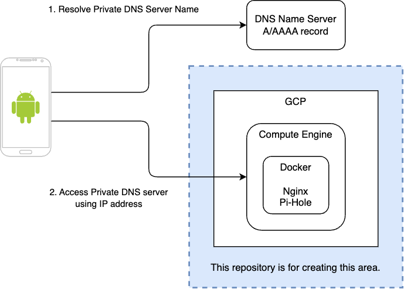

# Personal Pi-hole

This is my work log creating a personal pi-hole(https://pi-hole.net) machine on the GCP for Android private DNS.

I expect to speed up my mobile internet by dropping unnecessary network traffic.
Also, it improves security and privacy on the Internet.

Thank you @varunsridharan for the great article.

- https://blog.svarun.dev/configure-pi-hole-with-dns-over-tls-private-dns

## Overview

Here is an overview of the Android private DNS and components managed by this repository.
Since the Android requires a hostname of the private DNS as a nature of DNS over TLS, the private DNS server must have a domain name registered in another DNS server.




## Requirements

- Domain name of the pi-hole server
- Google Cloud Platform project

## Setup

### GCP Compute Engine

- Instance type: `e2-micro` (utilize free tire)
- OS: Ubuntu 22.04 LTS

See more details in [Create GCP Resources](create-gcp-resources.md)

SSH to the instance from the GCP web console.

### Release port 53 from systemd-resolved

Reference: https://www.linuxuprising.com/2020/07/ubuntu-how-to-free-up-port-53-used-by.html

Modify `/etc/systemd/resolved.conf`

``` bash
echo "# Lookup Google DNS
DNS=8.8.8.8
DNSStubListener=no" | \
  sudo tee -a /etc/systemd/resolved.conf
```

Confirmation

```shell
$ grep -v  '^#' /etc/systemd/resolved.conf

[Resolve]
DNS=8.8.8.8
DNSStubListener=no
```

Restart `systemd-resolved`

```bash
sudo systemctl restart systemd-resolved
```

### Clone repository

Clone this repository under the `/opt` directory.

```bash
cd /opt
sudo git clone https://github.com/superdaigo/personal-pi-hole.git
```

Create "/opt/personal-pi-hole/.env" file.
Replace "pi-hole.domain.name" with appropriate FQDN.

``` bash
echo "DOMAIN_NAME=pi-hole.domain.name" | sudo tee /opt/personal-pi-hole/.env
```

### Install docker

See the following URL.
https://docs.docker.com/engine/install/ubuntu/#install-using-the-repository


Confirm docker-compose.yaml

``` bash
cd /opt/personal-pi-hole
sudo docker compose config
```

### Certbot (Let's Encrypt)

Certbot is a tool to obtain/renew/delete a TLS certificate issued by Let's Encrypt.

- Let's Encrypt: https://letsencrypt.org
- Certbot: https://certbot.eff.org

Pull certbot image
- Certbot docker image: https://hub.docker.com/r/certbot/certbot/

``` bash
sudo docker pull certbot/certbot
```

Create a new TLS certificate (DNS authentication)

Replace `__EMAIL_ADDRESS__` and `__DOMAIN_NAME__` with proper values.

``` bash
cd /opt/personal-pi-hole

sudo docker run -it --rm \
  -v ./etc-letsencrypt/:/etc/letsencrypt/:rw \
  certbot/certbot \
  certonly \
  --manual \
  --agree-tos \
  --email __EMAIL_ADDRESS__ \
  --preferred-challenges dns \
  -d __DOMAIN_NAME__
```

Update your DNS record.

Start pi-hole

```bash
sudo docker compose up -d
```

## Pi-hole Web Admin Console

The Pi-hole web admin console is available through the IAP tunnel.

In this procedure, port 80 is not exposed to the Internet.

```bash
gcloud compute start-iap-tunnel __INSTANCE_ID__ 80 \
  --local-host-port=localhost:10001 \
  --zone=__ZONE__ \
  --project __GCP_PROJECT_ID__
```

http://localhost:10001/admin/

### Reset admin password

A random Pi-hole admin password is generated by pihole docker image.
You can see the password in the console output. But you can reset the password using the following command.

```bash
sudo docker exec pihole sudo pihole -a -p __COMPLEX_PASSWORD__
```

## Update container

Stop and delete running containers

``` bash
cd /opt/personal-pi-hole
sudo docker compose down
```

Update pi-hole docker image

``` bash
sudo docker compose pull
```

Update nginx docker image

``` bash
sudo docker compose build --pull
```

Start containers

``` bash
sudo docker compose up -d
```

## Renew certificate

TODO: Check later

``` bash
cd /opt/personal-pi-hole

sudo docker run -it --rm \
  -v ./etc-letsencrypt/:/etc/letsencrypt/:rw \
  certbot/certbot \
  certonly \
  --manual \
  --preferred-challenges dns \
  -d __DOMAIN_NAME__
```
